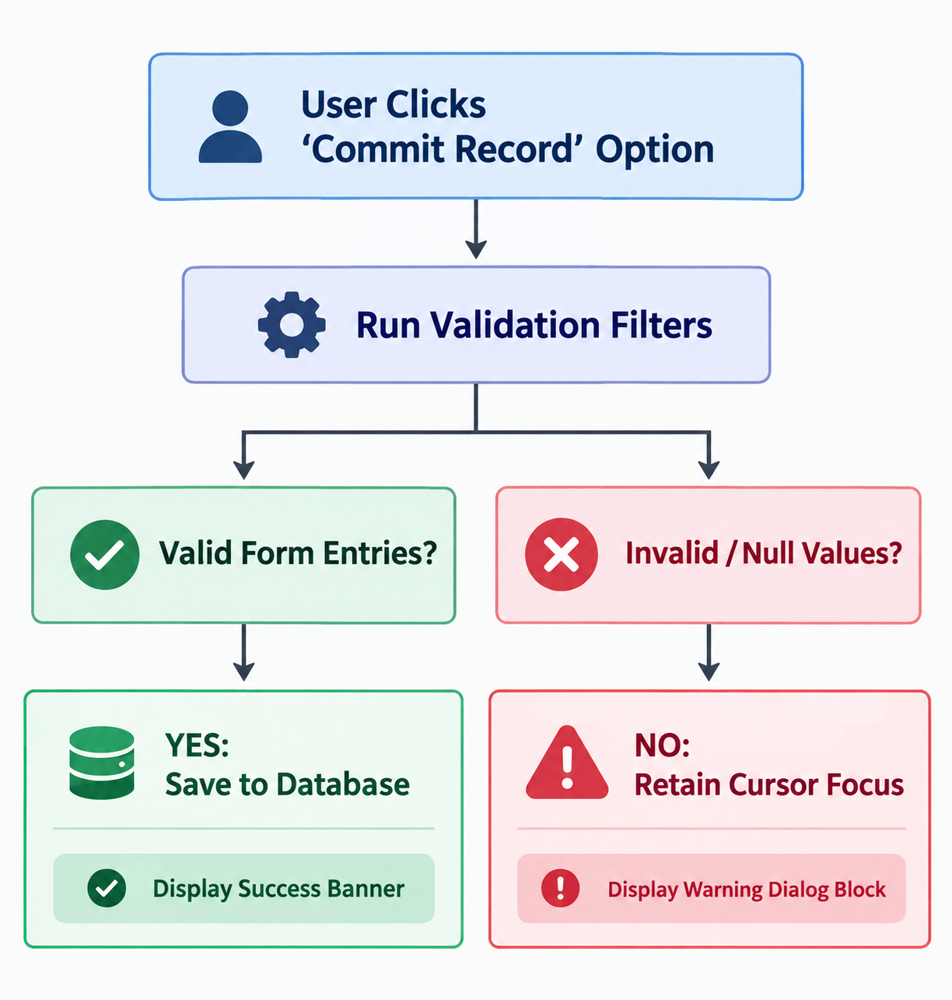

# Comprehensive Operational Manual: End-User Guide

This user guide provides structural instruction sets detailing the navigation and management of the application workspace portal.

---

## Portal Navigation Layout

Upon initial configuration, the execution link displays a uniform multi-panel console layout:
1. **Control Sidebar:** Houses links for view shifts (e.g., Data Insertion Form, Database Visual Audit Matrix, Audit Log).
2. **Dynamic Workspace Center:** Renders contextual charts, raw database schemas, and configuration modules.
3. **System Footprint Monitor:** Tracks persistent system variables, framework uptimes, and query execution health.

---

## Step-by-Step Task Frameworks

### Task 1: Adding a Product Record to Local Storage
Follow this precise sequence to successfully write a new asset instance to the persistence layer:

1. Locate the **Control Sidebar** layout panel and click the **"Stock Registration Form"** icon workspace.
2. Move cursor focus to the entry field labeled **"Unique SKU Code Identification"**. Type a alphanumeric identifier (e.g., `SKU-2026-ALPHA`).
   - *System Constraint:* Duplicate entries will be rejected immediately by active index rules.
3. Complete fields tracking item name definitions, numeric quantity bounds, and class designations.
4. Locate the green execution anchor option titled **"Commit Record to Database"**. Click it to initialize the system validation block.

---

## 🔍 Visual Reference: Troubleshooting Workflows

## Common Fault Recovery Steps

### Symptom: Portal Screen Freezes or Displays Empty Matrix Data Charts
- **Root Trigger Check:** The application container context has dropped connection handles to the backend `database.db` SQLite environment.
- **Remediation Procedure:**
  1. Open your system shell window where the local process is running.
  2. Kill the frozen node script context by executing a standard termination sequence (`Ctrl + C`).
  3. Verify file permission matrices by running `ls -la src/database/` to confirm the environment holds write authorizations.
  4. Relaunch the application node using the standard portal script signature: `streamlit run src/app.py`.